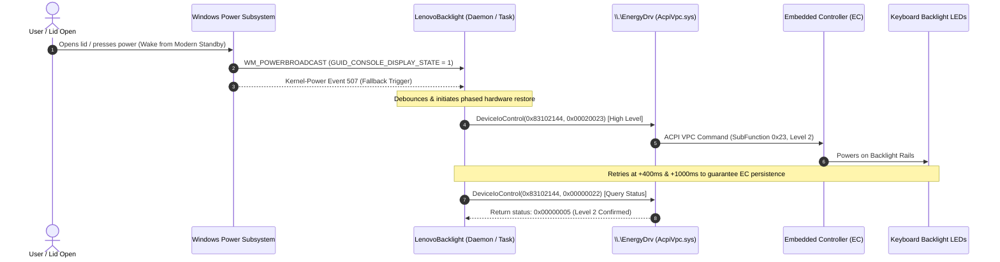

# LenovoBacklight

[](https://microsoft.com/windows)
[](LICENSE)
[-brightgreen.svg)](README.md)
[-orange.svg)](README.md)
[](README.md)

**Automatically restores your Lenovo laptop's keyboard backlight whenever the laptop wakes from sleep, Modern Standby (S0ix), or display turn-on.**

---

## The Problem

On many Lenovo laptops (including **IdeaPad 5 Pro, Legion, Yoga, and Slim** series):
- When your laptop enters sleep or Modern Standby (S0ix), the Embedded Controller (EC) turns off the keyboard backlight to save power.
- When you wake the laptop up or open the lid, **the keyboard backlight remains completely off**.
- You are forced to manually press <kbd>Fn</kbd> + <kbd>Space</kbd> every single time you wake your machine.
- Lenovo Vantage controls the backlight inside its GUI, but provides no option to auto-enable it on wake.
- Generic automation tools and key simulators fail because <kbd>Fn</kbd> is an internal hardware key not passed through Windows virtual key tables.

---

## The Solution: `LenovoBacklight`

`LenovoBacklight` reverse-engineers Lenovo Vantage's internal backend plugin (`IdeaNotebookAddin`) and communicates directly with Lenovo's ACPI Virtual Power Controller driver (`\\.\EnergyDrv`).

- **No Administrator Rights Required:** Operates completely within standard user permissions (no annoying UAC prompts).
- **Zero Dependencies:** A single standalone native Windows binary (< 25 KB). No Python, no external runtime, no Bloatware.
- **Instant Response (< 10 ms):** Uses Windows native Power Setting Notifications (`GUID_CONSOLE_DISPLAY_STATE`).
- **Fail-safe Dual Architecture:** Background wake daemon + Windows Task Scheduler event fallback (runs whether on battery or AC).
- **Negligible Resource Usage:** Consumes 0.0% CPU and negligible memory in the background.

---

## Architecture & How It Works



---

## Quick Start (Installation)

### Option 1: 1-Click Install (Recommended)

1. Clone or download this repository:
   ```cmd
   git clone https://github.com/trgcyln/lenovo-backlight-control.git
   cd lenovo-backlight-control
   ```
2. Double-click **`install.bat`** (or run `install.bat` from terminal).
3. That's it! The service is built, installed, started, and configured to auto-run on Windows startup.

### Option 2: Command Line Install

Run from PowerShell or Command Prompt (Standard user prompt is fine):
```cmd
git clone https://github.com/trgcyln/lenovo-backlight-control.git
cd lenovo-backlight-control
build.bat
bin\LenovoBacklight.exe install 2
```
*(Parameter `2` sets High brightness; use `1` for Low brightness)*.

---

## Command Line Reference

You can also use `LenovoBacklight.exe` as a fast CLI tool to check or toggle your backlight at any time:

| Command | Description |
|---|---|
| `LenovoBacklight.exe status` | Displays current hardware backlight level and wake daemon status |
| `LenovoBacklight.exe high` *(or `on`)* | Sets keyboard backlight to **High** (Level 2) |
| `LenovoBacklight.exe low` | Sets keyboard backlight to **Low** (Level 1) |
| `LenovoBacklight.exe off` | Turns keyboard backlight **Off** (Level 0) |
| `LenovoBacklight.exe toggle` | Cycles through Off -> Low -> High -> Off |
| `LenovoBacklight.exe install [level]` | Installs auto-wake daemon and scheduled task (default level: 2) |
| `LenovoBacklight.exe uninstall` | Completely uninstalls auto-wake daemon and scheduled task |

### Example CLI Output
```text
C:\> LenovoBacklight.exe status

[LenovoBacklight] Status:
  Hardware Backlight Level: 2 (High)
  Background Wake Daemon:   Running
  Log File:                 C:\Users\User\AppData\Local\LenovoBacklight\service.log
```

---

## Supported & Tested Hardware

Compatible with any Lenovo laptop using the **Lenovo Energy Management / ACPI Virtual Power Controller driver (`AcpiVpc.sys`)**:
- **Lenovo IdeaPad:** IdeaPad 5 Pro (14/16-inch), IdeaPad Gaming, IdeaPad 3, IdeaPad 5, Slim series
- **Lenovo Legion:** Legion 5, Legion 5 Pro, Legion 7, Legion Slim
- **Lenovo Yoga:** Yoga Slim 7, Yoga 7i, Yoga 9i
- **Lenovo ThinkPad / ThinkBook:** Models supporting Lenovo Energy Management backlight control

---

## Technical Protocol Details

For reverse engineers and developers, see the full writeup in [**`docs/REVERSE_ENGINEERING.md`**](docs/REVERSE_ENGINEERING.md).

### Quick Protocol Summary:
- **Device Symlink:** `\\.\EnergyDrv`
- **IOCTL:** `0x83102144` (`IOCTL_KBLC_CONTROL`)
- **Packet Format:** `(Level << 16) | 0x23`
  - `0x00020023` = Level 2 (High)
  - `0x00010023` = Level 1 (Low)
  - `0x00000023` = Level 0 (Off)
- **Status Query:** `0x00000022` (Returns `(Level << 1) | 1` on success)

---

## Building From Source

This project uses standard C# with zero external package dependencies. It compiles using Windows' built-in C# compiler (`csc.exe`) without needing Visual Studio or .NET SDK:

```cmd
build.bat
```
The compiled executable will be generated at `bin\LenovoBacklight.exe`.

---

## Uninstallation

To completely remove `LenovoBacklight`:
```cmd
uninstall.bat
```
Or run:
```cmd
LenovoBacklight.exe uninstall
```
This terminates the background daemon, removes the Windows Startup registry entry (`HKCU Run`), and deletes the Scheduled Task.

---

## License

This project is licensed under the [MIT License](LICENSE).
